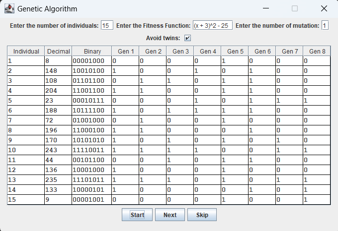

# Assignment 2 : Genetic_Algorithm
## Discipline : Java
### Description
Assignment 02 of java program in Concordia University, Montréal.\
Algorithm that selects the two best individuals from a population of individuals (decimal number) according to a sorting function (fitness function).
Once the two best individuals have been found, either crossovers between their genes (number translated into binary) or
a mutation is applied to the best one.
The individual who cancels the function (result equal to 0) is the best individual in the whole population.

### Extra features
* Possibility of banning twins
* Add your own fitness function
* Set the number of individuals in population
* Set the number of genes can be mutated
* Display all individuals in the population
* Displays the total number of crossovers and mutations
* Algorithm logo in terminal
* Use regex to enter fitness functions more easily
* Remains in menu until exit it
* With the project name, a `clear` is executed on the terminal to always keep the project
    name at the top of the terminal and keep it clean with no command history
* GUI : Graphic User Interface
  * We have two versions of our graphical interface, one is finished and functional (`GUI`),
  the other is under development due to the use of animations (`GUI2`).
  * Double-entry table
  * Applying color to mutated or crossover genes
  * Animated sorting of the population by fitness function
  * Various buttons
    * Start : population initialization
    * Next : proceed step by step, to see the progress, and whether a mutation or crossover has been applied
    * Skip : skip the step-by-step process and see the results straight away

\

# Authors

#### EFREI L3 - S5 - Promo 2026

[Mathis GITON](https://github.com/MathisG179)\
[Axel LOONES](https://github.com/AxelLns)\
[Thibaut MENIN](https://github.com/Pulsar94)\
[Marc ROUGAGNOU](https://github.com/MarcEfrei)

# Use

To run the project, you need to set up your SDK to 1.8.\
Run the `Main` function in `Main.java` to start the program in the terminal.\
Run `GUI` file to start the program with the Graphic User Interface.